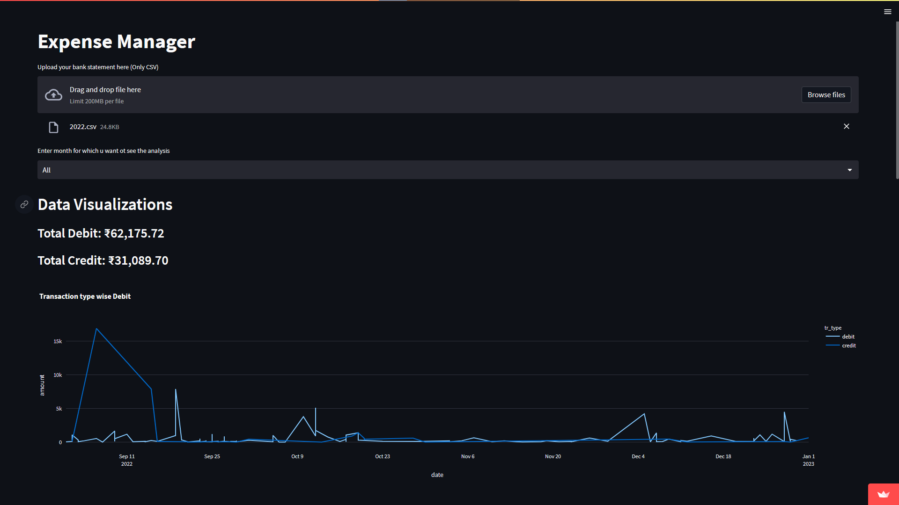
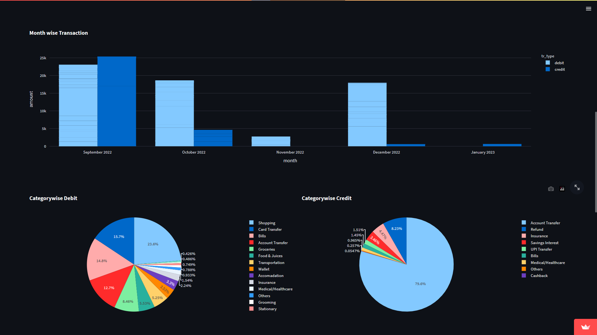
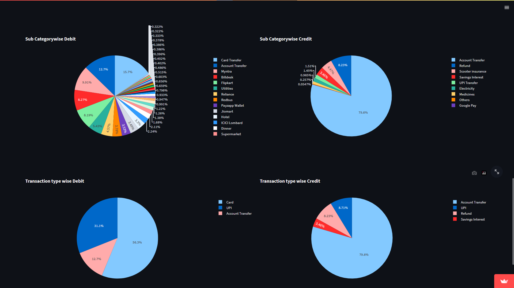

# Expense Manager

Categorization of expense from account statement

Website : [Expense Manager App](https://anirudh1905-expense-manager-main-vsixm8.streamlit.app/)

## How to download HDFC Bank statements as CSV

* Login to HDFC netbanking
* Accounts -> Enquire (Left Pane) -> A/c statement upto 5 years
* Select Account number, period and format as Delimited
* Finally save as type as "All Files" and name it as filename.csv

## Screenshots

***Data Privacy:** We dont store any of the users data*

***Note:** Currently only works for HDFC bank statements*
